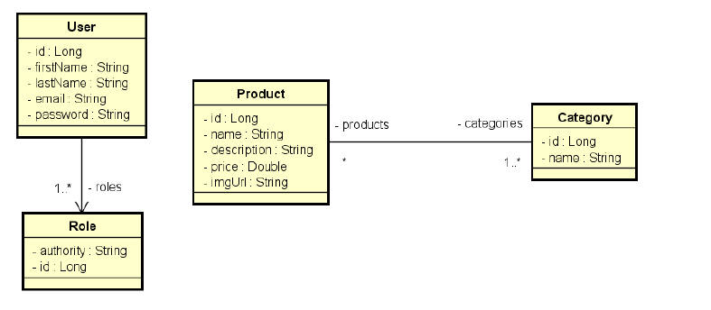

# Projeto DSCatalog
Este é o projeto principal da trilha do Java Spring Expert. O projeto consiste em um sistema de
catálogo de produtos, onde o objetivo do projeto é ensinar aos alunos como estruturar com
projeto completo com camadas, boas práticas, validação, segurança, tratamento de exceções,
consultas ao banco de dados, testes automatizados, dentre outros recursos. Esse projeto
também será o objeto de estudo para aplicar os tópicos do conteúdo programático da
trilha.

### Modelo de Domínio

### Tecnologias Utilizadas
- Java 21 LTS
- Spring Boot 3.3.8
- JPA
- H2
- PostgreSql
- Bean Validation
- JWT
- OAuth2
- JUnit5

### Habilidades Desenvolvidas
- CRUD
- Criação de API Rest;
- ORM com JPA;
- Modelo de projeto em camadas: Controladores, Serviços e Repositórios;
- Customização de respostas HTTP
- Tratamento de Exceções;
- Validação com Bean Validation;
- Consultas SQL e JPQL;
- Implementação de segurança com OAuth2 e JWT;
- Implementação de Testes Automatizados com JUnit5;
- Implementação de Serviço de envio de Email para recuperção de senha.

### Autor
[Leonardo](https://www.linkedin.com/in/leonardo-meireles-26b5b7338?utm_source=share&utm_campaign=share_via&utm_content=profile&utm_medium=android_app)
